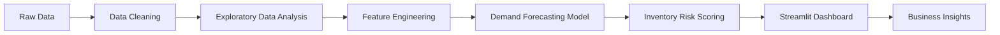

<div align="center">

# 📦 Project FORESIGHT
### Demand Forecasting & Inventory Intelligence

*A collaborative Data Science project developed as part of the **Zidio Development Internship**.*


</div>

---

## 📖 Overview

Project FORESIGHT is an end-to-end data science solution designed to improve **demand forecasting** and **inventory intelligence** through data-driven decision making.

The project focuses on helping organizations forecast product demand, optimize inventory levels, identify inventory risks, and provide actionable business insights through predictive analytics and interactive dashboards.

This repository serves as the central collaboration workspace for the project team throughout the internship.

---

## 🎯 Project Objectives

- Build a reliable data ingestion and preprocessing pipeline
- Perform exploratory data analysis (EDA)
- Engineer predictive features
- Develop demand forecasting models
- Generate inventory risk scores
- Build an interactive Streamlit dashboard
- Deploy a scoring API
- Present business insights and recommendations

---

## 💼 Business Problem

Many organizations struggle with inventory management due to inaccurate demand forecasting.

Common challenges include:

- Stock shortages
- Overstocking
- High inventory holding costs
- Lost sales opportunities
- Poor replenishment planning

Project FORESIGHT aims to address these challenges by transforming historical business data into actionable forecasting insights.

---

## 🏗️ System Architecture



---

## 📂 Repository Structure

```text
project-foresight-demand-inventory-intelligence/

├── api/                     # API services
├── dashboard/               # Streamlit dashboard
├── data/
│   ├── raw/                 # Original datasets
│   ├── interim/             # Intermediate datasets
│   └── processed/           # Clean datasets
│
├── docs/                    # Documentation
├── models/                  # Saved ML models
├── notebooks/               # Jupyter notebooks
├── presentation/            # Final presentation
├── reports/                 # Reports and outputs
├── src/
│   ├── data/
│   ├── features/
│   ├── models/
│   ├── utils/
│   └── visualization/
│
├── tests/
│
├── .env.example
├── CONTRIBUTING.md
├── LICENSE
├── README.md
└── requirements.txt
```

---

## ⚙️ Technology Stack

| Category | Technology |
|-----------|------------|
| Programming Language | Python |
| Data Analysis | Pandas, NumPy |
| Visualization | Matplotlib |
| Machine Learning | Scikit-learn |
| Dashboard | Streamlit |
| Version Control | Git & GitHub |
| Notebook Environment | Jupyter Notebook |

> Additional technologies will be added as development progresses.

---

## 📊 Dataset

The project uses datasets provided for **Project FORESIGHT** during the Zidio Development Internship.

Expected datasets include:

- Daily Sales
- Inventory Snapshots
- Product (SKU) Master Data
- Calendar Data

> **Note:** At the time of repository initialization, the official datasets are pending release by the internship support team.

---

## 🚀 Getting Started

Clone the repository:

```bash
git clone https://github.com/jairus011/project-foresight-demand-inventory-intelligence.git

cd project-foresight-demand-inventory-intelligence
```

Install dependencies:

```bash
pip install -r requirements.txt
```

---

## 🌿 Git Workflow

This project follows a collaborative Git workflow.

```
main
 │
 ▼
develop
 │
 ├── feature/data-pipeline
 ├── feature/eda
 ├── feature/forecasting
 ├── feature/dashboard
 └── feature/api
```

### Workflow

1. Create a feature branch.
2. Develop your feature.
3. Commit with meaningful messages.
4. Push your branch.
5. Open a Pull Request.
6. Review before merging into `develop`.
7. Merge `develop` into `main` for stable releases.

---

## 🗺️ Project Roadmap

### Phase 1 — Project Initialization

- [x] Repository setup
- [x] Documentation
- [x] Folder structure

### Phase 2 — Data Engineering

- [ ] Dataset acquisition
- [ ] Data cleaning
- [ ] Data preprocessing

### Phase 3 — Data Analysis

- [ ] Exploratory Data Analysis
- [ ] Feature Engineering

### Phase 4 — Machine Learning

- [ ] Demand Forecasting
- [ ] Model Evaluation
- [ ] Inventory Risk Scoring

### Phase 5 — Deployment

- [ ] Streamlit Dashboard
- [ ] API Development
- [ ] Documentation
- [ ] Final Presentation

---

## 🤝 Contributors

| Name | Role |
|------|------|
| Jairus Omondi | Repository Owner |
| Team Member | Data Science |
| Team Member | Data Science |
| Team Member | Data Science |

> Contributor details will be updated once the project team is finalized.

---

## 📌 Project Status

🚧 **Active Development**

The repository structure has been established. Development will begin once the official project datasets become available.

---

## 📄 License

This project is licensed under the **MIT License**.

---

<div align="center">

**Project FORESIGHT**  
*Building intelligent inventory decisions through data science.*

</div>